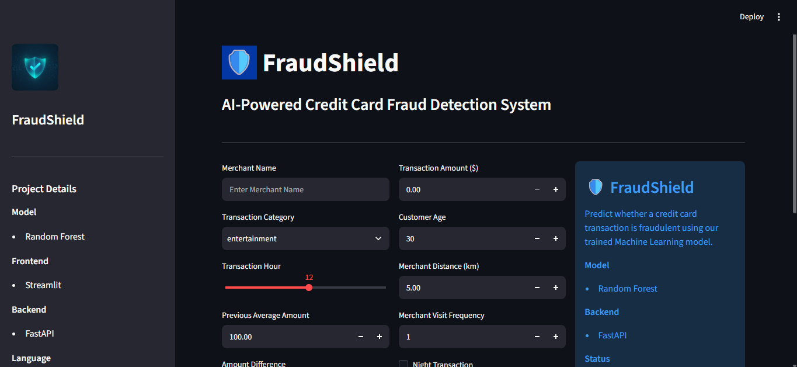
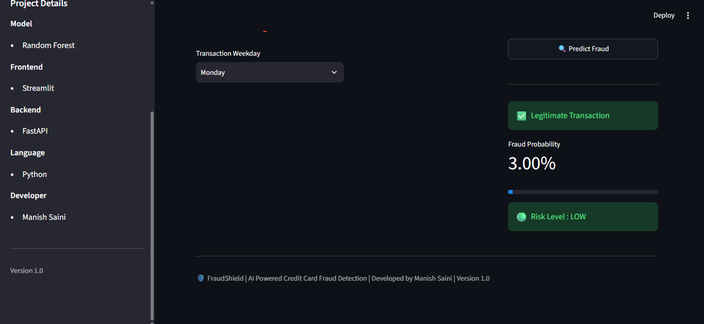

# 🛡️ FraudShield

AI-Powered Credit Card Fraud Detection System built using Machine Learning.

## 📌 Overview

FraudShield is a Machine Learning project that predicts whether a credit card transaction is **Fraudulent** or **Legitimate**.

The project uses a Random Forest Classifier trained on transaction data and provides predictions through a Streamlit web application with a FastAPI backend.


##  Features

- Credit Card Fraud Detection
- Random Forest Classifier
- FastAPI Backend
- Streamlit Frontend
- Feature Engineering
- Hyperparameter Tuning
- Probability Score
- Real-Time Prediction

---

##  Tech Stack

### Machine Learning
- Python
- Scikit-learn
- Pandas
- NumPy

### Backend
- FastAPI
- Uvicorn

### Frontend
- Streamlit

### Model
- Random Forest Classifier

---

##  Project Structure

```
FraudShield/
│
├── app/
│     └── app.py
│
├── artifacts/
│     ├── random_forest_model.joblib
│     ├── encoder.joblib
│     ├── merchant_map.joblib
│     └── feature_columns.joblib
│
├── dataset/
│
├── notebooks/
│     ├── EDA.ipynb
│     ├── Feature_Engineering.ipynb
│     ├── Preprocessing.ipynb
│     └── Model_Training.ipynb
│
├── src/
│     ├── predict.py
│     └── train_pipeline.py
│
├── requirements.txt
├── README.md
└── main.py
```

---

##  Installation

Clone the repository

```bash
git clone https://github.com/yourusername/FraudShield.git
```

Install dependencies

```bash
pip install -r requirements.txt
```

Run FastAPI

```bash
uvicorn main:app --reload
```

Run Streamlit

```bash
streamlit run app/app.py
```

---

## 📊 Model Performance

| Model | F1 Score |
|--------|---------:|
| Random Forest | **0.7488** |

---

## 📸 Screenshots


)
---

##  Future Improvements

- Docker
- Cloud Deployment
- Database Integration
- Authentication
- Better UI
- Explainable AI (SHAP)

---

## 👨‍💻 Developer

**Manish Saini**

B.Tech Artificial Intelligence & Machine Learning

---

##  If you like this project

Give this repository a ⭐ on GitHub.